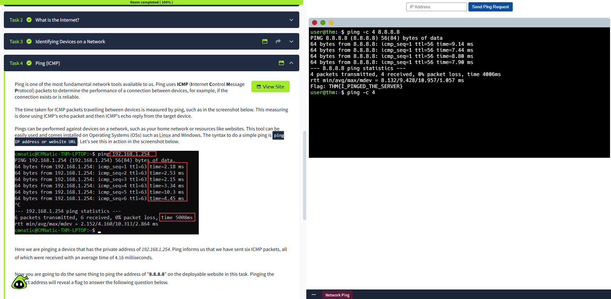
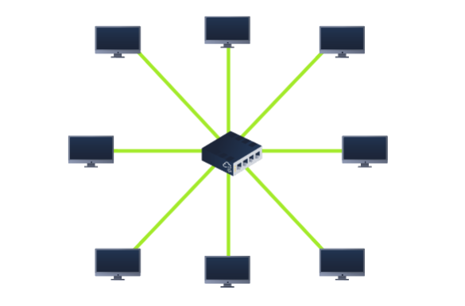
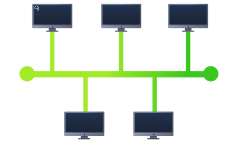
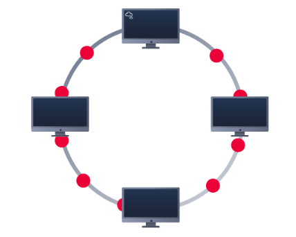
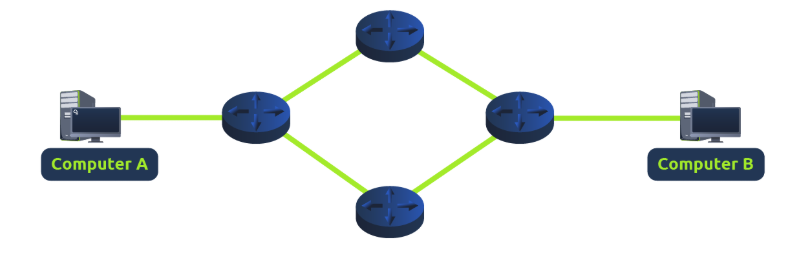
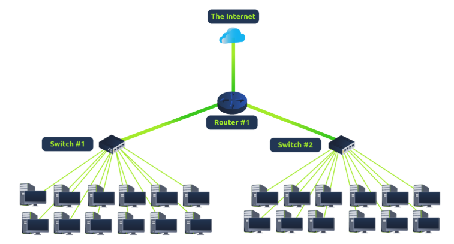
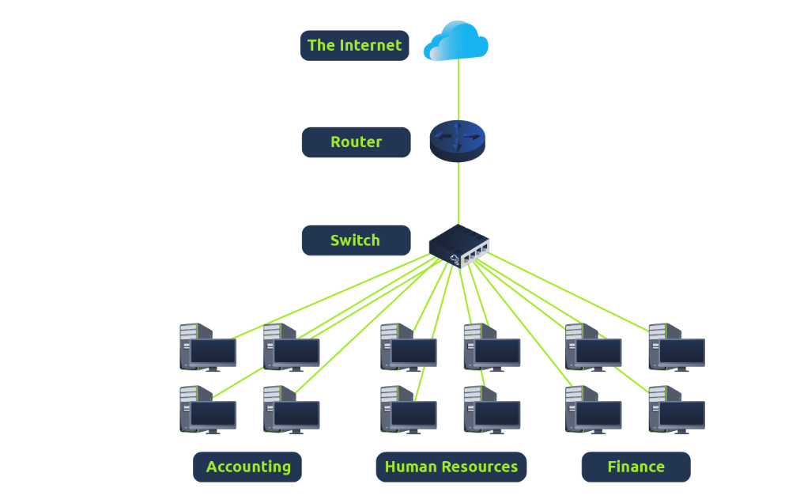
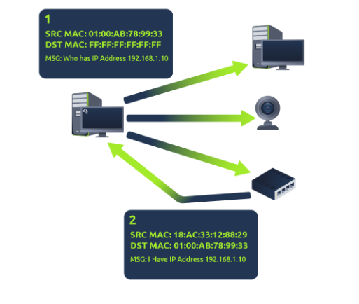
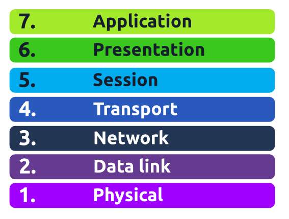

# Module 2 – Network Fundamentals

---

## 1. What is Networking

- **Networking** is connecting computers and devices to share data and resources.  
- Networks can be **LAN (Local Area Network)**, **WAN (Wide Area Network)**, **PAN (Personal Area Network)**, or **MAN (Metropolitan Area Network)**, depending on geographic scope.  
- **IP (Internet Protocol):** identifies devices on a network  
- **MAC (Media Access Control):** unique hardware address of devices  

### Other Notes
- IPv4 has 4 sections (2^32 addresses, ~4.29 billion total)  
- IPv6 has 8 sections (2^128 addresses, supports over 340 trillion addresses)  
- Each section of an IP address is called an **octet** (0–255)  
- Spoofing MAC addresses could let you access sites you normally don’t have access to  

**Command Used:**  
- `ping <IP>` – check connectivity  

## Screenshots 

### Ping Example

> **Personal Note:** I found it interesting how IPv4 and IPv6 addresses differ in size and how MAC addresses are unique to each device. I also liked learning about spoofing MAC addresses and how it could allow access to restricted systems.

---

## 2. Introduction to LAN

- **LAN (Local Area Network):** connects devices within a small area, such as a home, office, or school  
- **Topology:** design or layout of the LAN  

### Common Topologies
- **Star topology:** devices connect to a central switch or hub; robust and most common  
- **Bus topology:** devices share a single backbone cable; single point of failure, prone to bottlenecks  
- **Ring topology:** data passes in a loop; failure of cable stops the network  

> **Personal Note:** I liked how star topology is more robust than bus and ring topologies. Ring topology seems inefficient if a cable fails, which helps me understand why star is preferred today.

### Devices
- **NIC (Network Interface Card):** hardware component that allows a device to connect to a network; each NIC has a unique MAC address  
- **Switch:** connects multiple devices using Ethernet  
- **Router:** connects networks and passes data between them  

> **Personal Note:** I realized that NICs are fundamental because they provide the physical and MAC layer identity for a device. Switches and routers play a huge role in how data flows efficiently.

### Subnetting
- **Subnetting:** splitting a LAN into smaller subnetworks  
  - **Network address:** identifies the start of the subnet  
  - **Host address:** identifies devices within the subnet  
  - **Default gateway:** device responsible for sending data outside the subnet  
- **Subnet mask:** 32 bits, 4 bytes (0–255 each)  
- **Benefits:** efficiency, security, full control  

> **Personal Note:** Subnetting makes a network easier to manage and adds security by controlling broadcast domains. I can see why it’s important for large networks.

### ARP (Address Resolution Protocol)
- Resolves IP addresses to MAC addresses for communication  
- **How it works:**  
  1. Device broadcasts ARP request: “Who owns this IP address?”  
  2. Device with that IP responds with its MAC address (ARP reply)  
  3. Requesting device stores this mapping in **ARP cache**  

> **Personal Note:** Understanding ARP helped me see how devices learn about each other dynamically in a LAN.

### DHCP (Dynamic Host Configuration Protocol)
- IP addresses can be assigned **manually or automatically via DHCP**  
- **How DHCP works:**  
  1. Device sends DHCP Discover  
  2. DHCP server replies with DHCP Offer  
  3. Device confirms with DHCP Request  
  4. DHCP server acknowledges (DHCP ACK) – device can now use the IP  

> **Personal Note:** Practicing DHCP in labs helped me understand how devices automatically get IPs and why this is important for large networks.

## Screenshots

### Star Topology
  
### Bus Topology
  
### Ring Topology
  
### Router
  
### Switch
  
### Subnetting Example
  
### ARP Example

---

## 3. OSI Model

- **OSI model (Open Systems Interconnection Model)**  
  - Consists of seven layers, each with specific responsibilities, arranged from Layer 7 to Layer 1  
  - Encapsulation occurs when data moves down the layers, with headers/footers added  

## Screenshots

### OSI Model
 

### 3.1 Physical Layer
- Transfers raw bits (1s and 0s) over a physical medium  
- Examples: Ethernet cables, hubs, repeaters, NIC (Network Interface Card)  
- **Key Responsibilities:**  
  - Converting data into signals suitable for transmission  
  - Sending and receiving raw bit streams  
  - Defining the physical characteristics of cables, connectors, and signals  

> **Personal Note:** I found it interesting how even at this low level, faulty cables or bad NICs can stop an entire network.

### 3.2 Data Link Layer
- Handles **physical addressing** using **MAC addresses**  
- Creates **frames** and ensures data is delivered to the correct device  
- Key points: NICs, MAC addresses, frames  

> **Personal Note:** I noticed how ARP and MAC addresses are essential for delivering data to the right device within a LAN.

### 3.3 Network Layer
- Responsible for **routing data** from source to destination across networks  
- Uses **IP addresses** to determine where data should go  
- Combines packets into original data at the destination  
- **Layer 3 Devices:** routers  
- **Routing Factors:** shortest path, reliability, speed/connection type  
- **Common Protocols:** OSPF, RIP  

> **Personal Note:** Learning about routing made me understand how data finds the fastest and most reliable path, and why routers are Layer 3 devices.

### 3.4 Transport Layer
- Ensures **reliable delivery** of data  
- Segments data from **Session Layer**  
- **Protocols:**  
  - **TCP (Transmission Control Protocol):** connection-oriented, reliable, error-checked  
  - **UDP (User Datagram Protocol):** connectionless, fast  
- TCP guarantees order and completeness; UDP may lose or reorder data  

> **Personal Note:** It was clear why TCP is used for emails and file transfers, while UDP is better for video streaming where some data loss is acceptable.

### 3.5 Session Layer
- Manages **sessions** between devices: creation, maintenance, termination  
- Includes **checkpoints** so only lost segments are retransmitted  
- Sessions are unique; data cannot cross sessions  
- Examples: remote desktop, video conferencing, database connections  

> **Personal Note:** I liked the idea of checkpoints to save bandwidth when data is lost.

### 3.6 Presentation Layer
- Handles **data translation, formatting, and encryption**  
- Ensures data from the **Application Layer** is understood by the receiving device  
- Examples: emails between different clients, HTTPS, file conversions  

> **Personal Note:** Encryption at this layer really helps with secure web browsing.

### 3.7 Application Layer
- Closest to the **end user**  
- Provides **interfaces and protocols** for applications  
- Protocols: HTTP/HTTPS, FTP, **DNS**  
- **DNS** translates human-readable domain names (like `www.example.com`) into IP addresses (like 192.168.1.1), allowing devices to locate each other on the Internet.
- Examples: web browsing, email, file transfers, resolving domain names to IP addresses  

> **Personal Note:** Seeing how different email clients interpret the same data made me appreciate the importance of standard protocols.